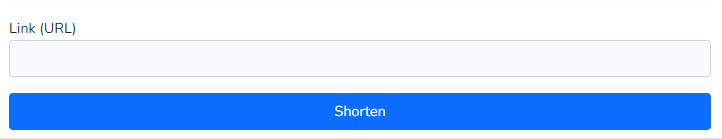
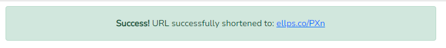
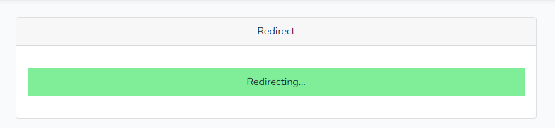
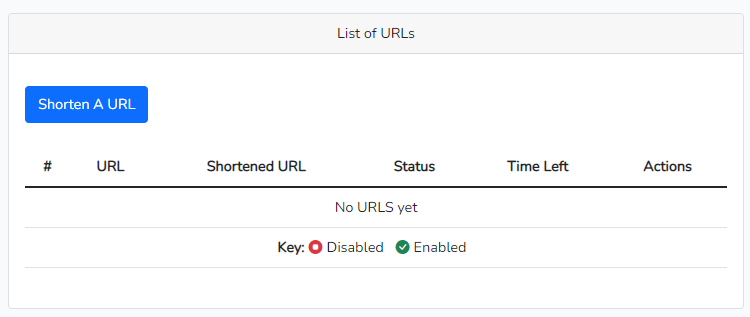
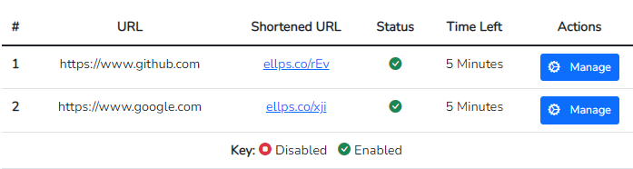
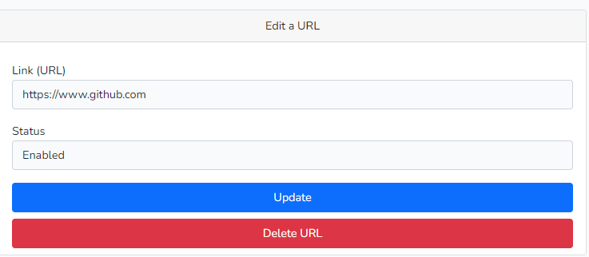
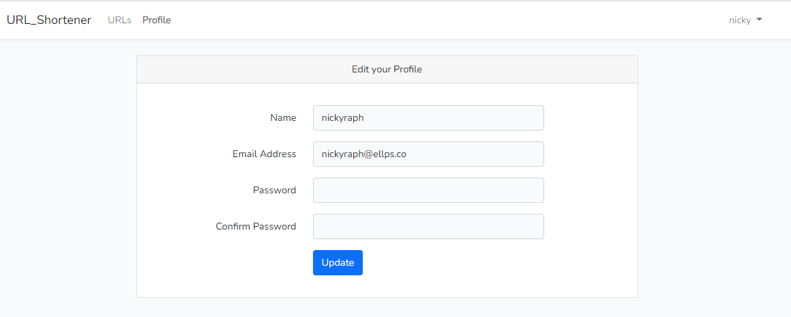

## URL Shortener

Ellipsis PHP Challenge

Welcome to the URL Shortener Web Application. This application takes long URLs from the user and shortens them, so they are easily managable and memorable.

This platform can be used by both registered and non registered users. Registered users however have the ability to view all their URLS, edit, delete or disable them from their dashbord.

### Getting Started
On the homepage, enter or paste a URL to shorten it

Press shorten and your link will be generated!

Upon clicking the shortened link, a new exit page will open and redirect you to the intended original long link.

### Managing Links
If you wish to manage links, click on the register link on top of the navigation menu and enter your details.
Upon successful registration, you will land on the dashboard where you can view and manage all your links.

#### Shortening links
The procedure is the same as that of non logged in users, with one difference that you can't shorten the same link twice. If you'd like to change it, you can edit it.

#### Updating links
After you start to shorten links, they will appear on the table, where a manage link can be seen.

Upon clicking the manage link, a page will appear where you can edit the link source and or change toggle the enabled/disabled status. You can also delete the URL.

### Profile management.
The web app also allows registered users to update their profiles by managing their name, email and password.
After a successful registration or login, users can manage their profiles by clicking on the profile link on the navigation menu.

The app also provide a functionality to reset password, by clicking the forgot password link on the login page and entering your email address. A reset link will be sent to that email address shortly, and it will contain the link where you can enter the new password.

### Short URLs Expiry
All Short URLs last for a specified period of time defined in the .env file. The default expiry time is 5 minutes

``
URL_EXPIRY_TIME=5
``

Upon expiry, the short URL is deleted and if the URL was created by a registered user, the user will be notified via email. 

This is achieved by setting up a cron job that runs the artisan console command every minute. The command grabs all links from the database that were created  in five or more minutes, and loops through them, sending an email to the user before deleting them.

### Short URLs Domain
Short URLs are prefixed by the domain defined in the .env file. The default domain is ellps.co

``
URL_DOMAIN=ellps.co
``

### Changelog

Please see [CHANGELOG](CHANGELOG.md) for more information what has changed recently.

## Contributing

Please see [CONTRIBUTING](CONTRIBUTING.md) for details.

### Security

If you discover any security related issues, please email raphpeterolomi@gmail.com instead of using the issue tracker.

## Credits

-   [NIckyRaph](https://github.com/nickyraph)

## License

The MIT License (MIT). Please see [License File](LICENSE.md) for more information.
